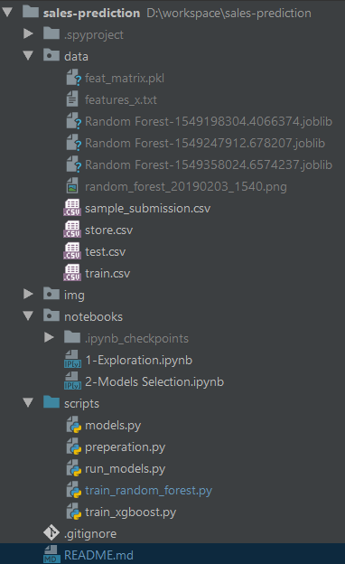

# sales-prediction

### A machine learning project for Udacity's Machine Learning Engineer NanoDegrees

#### Project description
A kaggle competition for sales forecasting

[Kaggle Project link](https://www.kaggle.com/c/rossmann-store-sales)

#### Project organization

- **data directory** 
contains different dataset files for training and test from [project data page](https://www.kaggle.com/c/rossmann-store-sales/data), 
it also contains intermediate results: 
 
    - **features_x.txt** - list of features for training
    - **train.csv** - historical data including Sales
    - **test.csv** - historical data excluding Sales
    - **sample_submission.csv** - a sample submission file in the correct format
    - **store.csv** - supplemental information about the stores

- **notebooks directory** 
contains data visualization and analysis in form of jupyter notebook

- **scripts directory** 
contains python code for models training:

    - **models.py** - methods for models training and evaluation
    - **preparation.py** - data cleaning and data preparation code
    - **2-run_basics.py** - run basic models without tuning for model comparison
    - **3-tune_random_forest.py** - tune random forest model and determine the optimized parameters
    - **3-tune_xgboost.py: tune** - xgboost model and determine the optimized parameters
    - **4-train_random_forest.py** - train random forest with the optimized (step 3) parameters
    - **4-train_xgboost.py** - train xgboost with the optimized (step 3) parameters
    - **5-evaluate.py** - make prediction with the persistent models (*.joblib, *.model) and evaluate the result
    - **6-final_model.py** - select the best model and train with complete dataset: train data + validation data
    
- some big data files are in the google drive as following link: 
[Big files in Google Drive](https://drive.google.com/open?id=1J0LKDANYdk-bSciZjzH_GZN31PLY1mKv)

    - feat_matrix.pkl: persistence of feature matrix
    - *.joblib: persistence of models