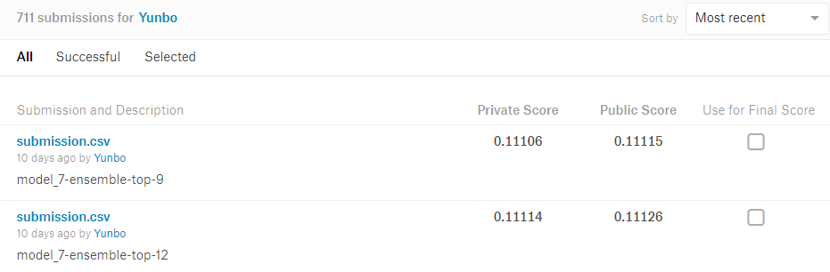

# Sales Prediction

### A machine learning project for Udacity's Machine Learning Engineer Nano Degree

#### Project description
A kaggle competition for sales forecasting

[Kaggle Project link](https://www.kaggle.com/c/rossmann-store-sales)

#### Project organization

- **data directory**<br>
contains different dataset files for training and test from [project data page](https://www.kaggle.com/c/rossmann-store-sales/data), 
it also contains intermediate results: 
 
    - **features_x.txt** - list of features for training
    - **train.csv** - historical data including Sales
    - **test.csv** - historical data excluding Sales
    - **sample_submission.csv** - a sample submission file in the correct format
    - **store.csv** - supplemental information about the stores
    - **submission.csv** - prediction results
    - **external** - external data (weather and store state)

- **notebooks directory**<br>
contains data visualization and analysis in form of jupyter notebook

- **root directory**<br>
contains python code for models training:

    - **1.0-quick_scoring.py** - run basic models without tuning for model comparison (duration ~ 10 minutes):

```
2019-05-06 20:03:19,526 - [root] - [INFO]: checking outliers: done, total outliers: 93961
2019-05-06 20:03:19,526 - [root] - [INFO]: columns: ['SoonChristmas' 'WasChristmas' 'Precipitationmm' 'SoonRefurbishments'
 'WasRefurbishments']
2019-05-06 20:03:23,894 - [root] - [INFO]: --- 3.82 minutes ---
2019-05-06 20:03:26,399 - [root] - [INFO]: linear regression score = 0.20911571779656873
2019-05-06 20:04:15,126 - [root] - [INFO]: xgboost score = 0.1525861564653531
2019-05-06 20:04:52,786 - [root] - [INFO]: random forest score = 0.1357256700211379
2019-05-06 20:04:52

Process finished with exit code 0
```
-
    - **2.1-tune_random_forest.py** - tune random forest model and determine the optimized parameters (duration ~ 13h)
```
2019-05-06 21:28:51,234 - [root] - [INFO]: features are previously extracted
2019-05-06 21:28:51,895 - [root] - [INFO]: all features: ['AvgCustomersSchoolHoliday', 'IsSunday', 'DayOfWeek', 'Year', 'LastDayCustomers', 'DayOfYear', 'Assortment', 'AvgCustomersPromo', 'MonthsSincePromo2', 'AvgSales', 'IsSaturday', 'SoonRefurbishments', 'AvgYearCustomers', 'CompetitionDistance', 'SoonChristmas', 'CompetitionOpenSince', 'Promo2Weeks', 'AvgCustomers', 'WasChristmas', 'DayOfMonth', 'AvgWeekCustomers', 'WasRefurbishments', 'Week', 'LastDaySales', 'AvgWeekSales', 'AvgSchoolHoliday', 'StoreType', 'WasPromo', 'Month', 'SoonPromo', 'HolidayLastWeek', 'Avg3MonthsSales', 'AvgYearSales', 'Promo', 'AvgPromo', 'HolidayNextWeek', 'SchoolHoliday', 'Avg3MonthsCustomers', 'SalesPerCustomer', 'RatioOnSchoolHoliday', 'RatioOnPromo', 'RatioOnSaturday', 'Max_TemperatureC', 'Precipitationmm']
2019-05-06 21:28:51,895 - [root] - [INFO]: target: SalesLog
2019-05-06 21:28:51,895 - [root] - [INFO]: feature matrix dimension: (1058297, 58)
Fitting 5 folds for each of 100 candidates, totalling 500 fits
[Parallel(n_jobs=6)]: Using backend LokyBackend with 6 concurrent workers.
[CV] warm_start=True, oob_score=True, n_estimators=10, min_weight_fraction_leaf=0, min_samples_split=10, min_samples_leaf=2, min_impurity_decrease=0, max_leaf_nodes=None, max_features=auto, max_depth=100, bootstrap=True 
[CV] warm_start=True, oob_score=True, n_estimators=10, min_weight_fraction_leaf=0, min_samples_split=10, min_samples_leaf=2, min_impurity_decrease=0, max_leaf_nodes=None, max_features=auto, max_depth=100, bootstrap=True 
[CV] warm_start=True, oob_score=True, n_estimators=10, min_weight_fraction_leaf=0, min_samples_split=10, min_samples_leaf=2, min_impurity_decrease=0, max_leaf_nodes=None, max_features=auto, max_depth=100, bootstrap=True 
[CV] warm_start=True, oob_score=True, n_estimators=10, min_weight_fraction_leaf=0, min_samples_split=10, min_samples_leaf=2, min_impurity_decrease=0, max_leaf_nodes=None, max_features=auto, max_depth=100, bootstrap=True 
[CV] warm_start=True, oob_score=True, n_estimators=10, min_weight_fraction_leaf=0, min_samples_split=10, min_samples_leaf=2, min_impurity_decrease=0, max_leaf_nodes=None, max_features=auto, max_depth=100, bootstrap=True 
[CV] warm_start=True, oob_score=True, n_estimators=10, min_weight_fraction_leaf=0, min_samples_split=3, min_samples_leaf=100, min_impurity_decrease=0, max_leaf_nodes=None, max_features=auto, max_depth=100, bootstrap=True 

...

Best score: -0.012038720253518406
Best params: 
bootstrap: True
max_depth: 200
max_features: 'auto'
max_leaf_nodes: None
min_impurity_decrease: 0
min_samples_leaf: 10
min_samples_split: 2
min_weight_fraction_leaf: 0
n_estimators: 150
oob_score: True
warm_start: True
--- 13.3 hours ---

Process finished with exit code 0
```
-
    - **2.2-tune_xgboost.py:** - tune xgboost model and determine the optimized parameters (duration ~ 13h)
```
2019-05-06 21:53:34,211 - [root] - [INFO]: features are previously extracted
2019-05-06 21:53:34,912 - [root] - [INFO]: all features: ['AvgCustomersSchoolHoliday', 'IsSunday', 'DayOfWeek', 'Year', 'LastDayCustomers', 'DayOfYear', 'Assortment', 'AvgCustomersPromo', 'MonthsSincePromo2', 'AvgSales', 'IsSaturday', 'SoonRefurbishments', 'AvgYearCustomers', 'CompetitionDistance', 'SoonChristmas', 'CompetitionOpenSince', 'Promo2Weeks', 'AvgCustomers', 'WasChristmas', 'DayOfMonth', 'AvgWeekCustomers', 'WasRefurbishments', 'Week', 'LastDaySales', 'AvgWeekSales', 'AvgSchoolHoliday', 'StoreType', 'WasPromo', 'Month', 'SoonPromo', 'HolidayLastWeek', 'Avg3MonthsSales', 'AvgYearSales', 'Promo', 'AvgPromo', 'HolidayNextWeek', 'SchoolHoliday', 'Avg3MonthsCustomers', 'SalesPerCustomer', 'RatioOnSchoolHoliday', 'RatioOnPromo', 'RatioOnSaturday', 'Max_TemperatureC', 'Precipitationmm']
2019-05-06 21:53:34,912 - [root] - [INFO]: target: SalesLog
2019-05-06 21:53:34,912 - [root] - [INFO]: feature matrix dimension: (1058297, 58)
Fitting 5 folds for each of 1 candidates, totalling 5 fits
[Parallel(n_jobs=6)]: Using backend LokyBackend with 6 concurrent workers.
[0]	validation_0-rmse:7.36423	validation_0-rmspe:0.933714
Multiple eval metrics have been passed: 'validation_0-rmspe' will be used for early stopping.

Will train until validation_0-rmspe hasn't improved in 50 rounds.
[1]	validation_0-rmse:7.00676	validation_0-rmspe:0.933529
[2]	validation_0-rmse:6.67076	validation_0-rmspe:0.933272

...

Best score: -0.011339540066649505
Best params: 
colsample_bytree: 0.7
gamma: 0.53
learning_rate: 0.1
max_depth: 12
min_child_weight: 0.5
n_estimators: 130
reg_lambda: 100
silent: False
subsample: 0.6
tree_method: 'gpu_hist'
--- 12.7 hours ---
```
-
    - **3.1-train_random_forest.py** - train random forest with the tuned (step 2.1) parameters (duration ~ 10 minutes)
```
2019-05-06 22:02:11,683 - [root] - [INFO]: features are previously extracted
2019-05-06 22:02:12,372 - [root] - [INFO]: all features: ['AvgCustomersSchoolHoliday', 'IsSunday', 'DayOfWeek', 'Year', 'LastDayCustomers', 'DayOfYear', 'Assortment', 'AvgCustomersPromo', 'MonthsSincePromo2', 'AvgSales', 'IsSaturday', 'SoonRefurbishments', 'AvgYearCustomers', 'CompetitionDistance', 'SoonChristmas', 'CompetitionOpenSince', 'Promo2Weeks', 'AvgCustomers', 'WasChristmas', 'DayOfMonth', 'AvgWeekCustomers', 'WasRefurbishments', 'Week', 'LastDaySales', 'AvgWeekSales', 'AvgSchoolHoliday', 'StoreType', 'WasPromo', 'Month', 'SoonPromo', 'HolidayLastWeek', 'Avg3MonthsSales', 'AvgYearSales', 'Promo', 'AvgPromo', 'HolidayNextWeek', 'SchoolHoliday', 'Avg3MonthsCustomers', 'SalesPerCustomer', 'RatioOnSchoolHoliday', 'RatioOnPromo', 'RatioOnSaturday', 'Max_TemperatureC', 'Precipitationmm']
2019-05-06 22:02:12,373 - [root] - [INFO]: target: SalesLog
2019-05-06 22:02:12,373 - [root] - [INFO]: feature matrix dimension: (1058297, 58)
Improved random-forest RMSPE =  0.1222678463438161
--- 0.11 hours ---

Process finished with exit code 0
```
-
    - **3.2-train_xgboost.py** - train xgboost with the optimized (step 2.2) parameters (duration ~ 10 minutes)
```
2019-05-06 22:19:11,535 - [root] - [INFO]: features are previously extracted
2019-05-06 22:19:12,193 - [root] - [INFO]: all features: ['AvgCustomersSchoolHoliday', 'IsSunday', 'DayOfWeek', 'Year', 'LastDayCustomers', 'DayOfYear', 'Assortment', 'AvgCustomersPromo', 'MonthsSincePromo2', 'AvgSales', 'IsSaturday', 'SoonRefurbishments', 'AvgYearCustomers', 'CompetitionDistance', 'SoonChristmas', 'CompetitionOpenSince', 'Promo2Weeks', 'AvgCustomers', 'WasChristmas', 'DayOfMonth', 'AvgWeekCustomers', 'WasRefurbishments', 'Week', 'LastDaySales', 'AvgWeekSales', 'AvgSchoolHoliday', 'StoreType', 'WasPromo', 'Month', 'SoonPromo', 'HolidayLastWeek', 'Avg3MonthsSales', 'AvgYearSales', 'Promo', 'AvgPromo', 'HolidayNextWeek', 'SchoolHoliday', 'Avg3MonthsCustomers', 'SalesPerCustomer', 'RatioOnSchoolHoliday', 'RatioOnPromo', 'RatioOnSaturday', 'Max_TemperatureC', 'Precipitationmm']
2019-05-06 22:19:12,194 - [root] - [INFO]: target: SalesLog
2019-05-06 22:19:12,194 - [root] - [INFO]: feature matrix dimension: (1058297, 58)
{'max_depth': 12, 'learning_rates': 0.1, 'gamma': 0.54, 'colsample_bytree': 0.7, 'min_child_weight': 0.5, 'n_estimator': 130, 'reg_lambda': 230, 'subsample': 0.6, 'nthread': 7, 'random_state': 16, 'tree_method': 'gpu_hist', 'silent': True}
[0]	train-rmse:5.7924	validation-rmse:5.53585	train-rmspe:0.996863	validation-rmspe:0.931083
Multiple eval metrics have been passed: 'validation-rmspe' will be used for early stopping.

Will train until validation-rmspe hasn't improved in 100 rounds.
[40]	train-rmse:0.09768	validation-rmse:3.12964	train-rmspe:0.167088	validation-rmspe:0.116181
[80]	train-rmse:0.086911	validation-rmse:3.12991	train-rmspe:0.154823	validation-rmspe:0.109931
[120]	train-rmse:0.081762	validation-rmse:3.13016	train-rmspe:0.146175	validation-rmspe:0.107399
[160]	train-rmse:0.078288	validation-rmse:3.13011	train-rmspe:0.14043	validation-rmspe:0.106002
[200]	train-rmse:0.075712	validation-rmse:3.12994	train-rmspe:0.135052	validation-rmspe:0.105282
[240]	train-rmse:0.073464	validation-rmse:3.12989	train-rmspe:0.130475	validation-rmspe:0.105089
[280]	train-rmse:0.071568	validation-rmse:3.12965	train-rmspe:0.126423	validation-rmspe:0.104712
[320]	train-rmse:0.069752	validation-rmse:3.12982	train-rmspe:0.123019	validation-rmspe:0.104311
[360]	train-rmse:0.06818	validation-rmse:3.12982	train-rmspe:0.119564	validation-rmspe:0.104316
[400]	train-rmse:0.066737	validation-rmse:3.12962	train-rmspe:0.116111	validation-rmspe:0.104132
[440]	train-rmse:0.065446	validation-rmse:3.1296	train-rmspe:0.112435	validation-rmspe:0.104149
[480]	train-rmse:0.064161	validation-rmse:3.12954	train-rmspe:0.108896	validation-rmspe:0.103915
[520]	train-rmse:0.06294	validation-rmse:3.12949	train-rmspe:0.105921	validation-rmspe:0.103935
[560]	train-rmse:0.062038	validation-rmse:3.12923	train-rmspe:0.103517	validation-rmspe:0.103708
[600]	train-rmse:0.060951	validation-rmse:3.12925	train-rmspe:0.099066	validation-rmspe:0.103683
[640]	train-rmse:0.059958	validation-rmse:3.12923	train-rmspe:0.094582	validation-rmspe:0.103662
[680]	train-rmse:0.059115	validation-rmse:3.12929	train-rmspe:0.092117	validation-rmspe:0.103589
[720]	train-rmse:0.058259	validation-rmse:3.12937	train-rmspe:0.089544	validation-rmspe:0.10366
[760]	train-rmse:0.057473	validation-rmse:3.12941	train-rmspe:0.08657	validation-rmspe:0.103695
Stopping. Best iteration:
[670]	train-rmse:0.059301	validation-rmse:3.12913	train-rmspe:0.092652	validation-rmspe:0.103478

best tree limit: 671
XGBoost RMSPE =  ('rmspe', 0.10347781547361246)
--- 0.15 hours ---

Process finished with exit code 0
```
-
    - **3.3-train_ensemble.py** - train ensemble models based on xgboost (duration ~ 16h)
        - results are recorded into sqlite database `model.db`
-
    - **3.4-train_ensemble_on_google.py** - train ensemble models on Google AI Platform (duration ~ 4h)
        - setup python client environment with [this procedure](https://cloud.google.com/ml-engine/docs/tensorflow/python-client-library)
        - a billing account is required
        - the generated credentials should be set with following commands
```
GOOGLE_APPLICATION_CREDENTIALS=<path to generated credentials .json file>
GOOGLE_CLOUD_PROJECT=<project-name>
```

-
    - **4.0-final_model.py** - select the best model ensemble and summit the result to Kaggle (duration ~ 20 seconds)
        - select best model ensemble according to scores in database
        - the individual models of the ensemble are previously trained from step 3.3 or 3.4
        - results:
```
2019-05-06 23:24:12,209 - [root] - [INFO]: features are previously extracted
2019-05-06 23:24:12,926 - [root] - [INFO]: all features: ['HolidayNextWeek', 'IsSaturday', 'Avg3MonthsSales', 'Year', 'AvgSchoolHoliday', 'AvgYearCustomers', 'DayOfYear', 'SoonChristmas', 'AvgCustomers', 'AvgCustomersSchoolHoliday', 'AvgYearSales', 'SoonRefurbishments', 'Promo2Weeks', 'Month', 'AvgPromo', 'Week', 'CompetitionOpenSince', 'IsSunday', 'WasChristmas', 'AvgSales', 'AvgCustomersPromo', 'HolidayLastWeek', 'DayOfWeek', 'StoreType', 'Avg3MonthsCustomers', 'Promo', 'Assortment', 'WasPromo', 'MonthsSincePromo2', 'DayOfMonth', 'SoonPromo', 'SchoolHoliday', 'Max_TemperatureC', 'Precipitationmm', 'CompetitionDistance', 'WasRefurbishments', 'SalesPerCustomer', 'RatioOnSchoolHoliday', 'RatioOnPromo', 'RatioOnSaturday']
2019-05-06 23:24:12,926 - [root] - [INFO]: target: SalesLog
2019-05-06 23:24:12,926 - [root] - [INFO]: feature matrix dimension: (1058297, 58)
2019-05-06 23:24:13,068 - [root] - [INFO]: models size: (9, 9)
2019-05-06 23:24:21,265 - [root] - [INFO]: saving result:
    Sales
Id       
1    4696
2    7561
3    9172
4    7112
5    7437
2019-05-06 23:24:21,388 - [root] - [INFO]: submitting model_7-ensemble-top-9 ...
Successfully submitted to Rossmann Store Sales
2019-05-06 23:24:33,666 - [root] - [INFO]: getting result of model_7-ensemble-top-9 ...
[(9, fileName                submission.csv
date               2019-05-06 21:24:31
description     model_7-ensemble-top-9
status                        complete
publicScore                    0.11115
privateScore                   0.11106
Name: 0, dtype: object)]
```  


-      
    - **trainer directory** - reusable methods ans scripts
        - **preparation.py** - data cleaning and data engineering code
        - **models.py** - methods for models training and evaluation
        - **submit_models.py** - summit predictions to Kaggle and save results into database 
        - **feature_selection.py** - select features which makes the score worse  
        - **task.py** - ensemble training task, can be executed either on **Google AI Platform** or on **local machine**
        - **util.py** - utility function for Google Storage management
    
- some big data files are in the google drive as following link:<br>
[Big files in Google Drive](https://drive.google.com/open?id=1J0LKDANYdk-bSciZjzH_GZN31PLY1mKv)

    - **feat_matrix.pkl**: persistence of feature matrix
    - ***.joblib**: persistence of models
    
#### final score
- XGBoost: 0.11106

#### project report
[PDF file](Rossmann_project_report.pdf)

