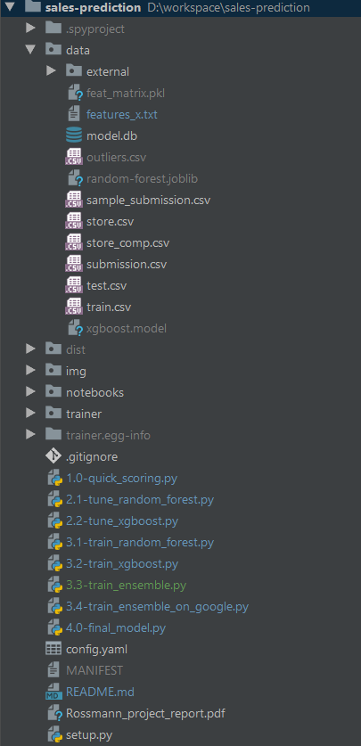

# sales-prediction

### A machine learning project for Udacity's Machine Learning Engineer NanoDegrees

#### Project description
A kaggle competition for sales forecasting

[Kaggle Project link](https://www.kaggle.com/c/rossmann-store-sales)

#### Project structure

- data directory

contains different dataset files for training and test from project description (https://www.kaggle.com/c/rossmann-store-sales/data), 
it also contains intermediate results: 

    - features_x.txt: list of features for training
    - train.csv - historical data including Sales
    - test.csv - historical data excluding Sales
    - sample_submission.csv - a sample submission file in the correct format
    - store.csv - supplemental information about the stores

- notebooks directory

data visualization and analysis in form of jupyter notebook

- scripts directory

python code for models training:

    - models.py: methods for training models
    - preperation.py: data cleaning and data preparation code
    - run_models.py: run basic models without tuning
    - train_random_forest.py: tune randome forest model and evaluate the result
    - train_xgboost.py: tune xgboost model and evaluate the result
    
- some big data files are in the google drive as following link:

[Big files in Google Drive](https://drive.google.com/open?id=1J0LKDANYdk-bSciZjzH_GZN31PLY1mKv)

    - feat_matrix.pkl: persistence of feature matrix
    - *.joblib: persistence of models